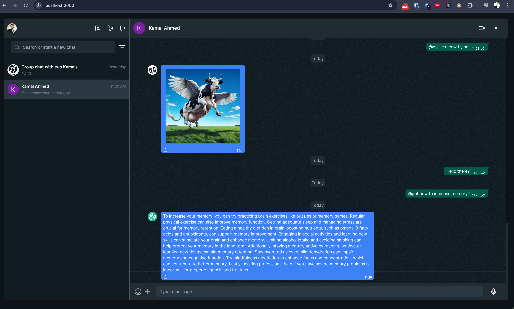

This is a [Next.js](https://nextjs.org/) project bootstrapped with [`create-next-app`](https://github.com/vercel/next.js/tree/canary/packages/create-next-app).

## Live Preview
View Live Preview [https://whatsapp-ai-opal.vercel.app/](https://whatsapp-ai-opal.vercel.app/)



## Getting Started

First, run the development server:

```bash
npm run dev
# or
yarn dev
# or
pnpm dev
# or
bun dev
```
Edit the .env-sample to .env.local and then enter the credentials from each services

Open [http://localhost:3000](http://localhost:3000) with your browser to see the result.

For Getting response from chat gpt use `@gpt` then your message. eg. @gpt what is best healthy breakfast?
For Dalle image generation, you can use '@dall-e imagine a cow flying'. Note, in the test app, please do not use more than 1 dalle request. because it is paid service and I am using my own money for showcasing the demo. It is a request.

You can start editing the page by modifying `app/page.tsx`. The page auto-updates as you edit the file.

This project uses [`next/font`](https://nextjs.org/docs/basic-features/font-optimization) to automatically optimize and load Inter, a custom Google Font.

## Learn More

To learn more about Next.js, take a look at the following resources:

- [Next.js Documentation](https://nextjs.org/docs) - learn about Next.js features and API.
- [Learn Next.js](https://nextjs.org/learn) - an interactive Next.js tutorial.

You can check out [the Next.js GitHub repository](https://github.com/vercel/next.js/) - your feedback and contributions are welcome!

## Deploy on Vercel

The easiest way to deploy your Next.js app is to use the [Vercel Platform](https://vercel.com/new?utm_medium=default-template&filter=next.js&utm_source=create-next-app&utm_campaign=create-next-app-readme) from the creators of Next.js.

Check out our [Next.js deployment documentation](https://nextjs.org/docs/deployment) for more details.
